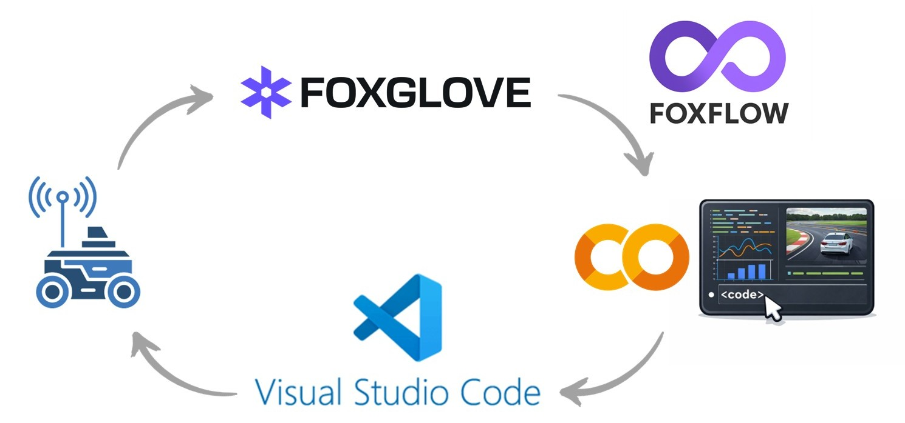
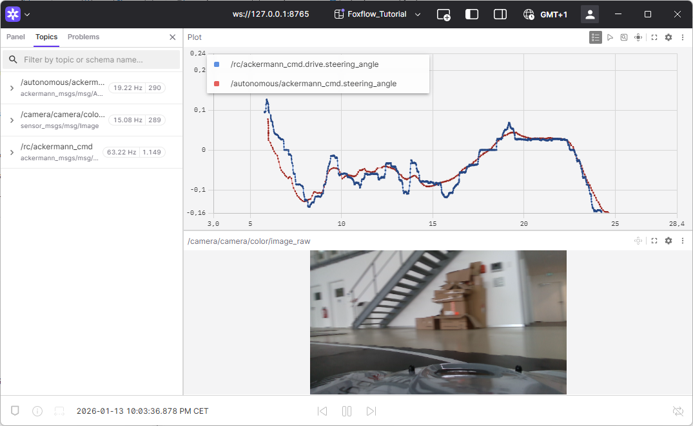

# road_follower

This repository contains the **accompanying code** for the Medium article [**“A Modern Workflow for ROS Development Using Google Colab and Foxglove”**](https://medium.com/@engelwilliam97/). The article presents a workflow that moves ROS development into Google Colab, where real robot data and Foxglove visualizations can be explored and tested without dealing with Linux, ROS, drivers, and hardware every time you change a line of code.

---

This project is **threefold**, as illustrated in the diagram:

* On the **left**, the **Medium article** presents the conceptual workflow and explains why this approach improves productivity for robotics beginners and experts alike.
* In the **middle**, the **interactive Colab notebook** serves as our playground for exploring sensor data, visualizing results, and iteratively developing code in a reproducible and sharable environment *(see `notebooks/Simple_Road_Follower.ipynb` or open it directly in Colab via [Link to notebook](https://colab.research.google.com/drive/1KwrhN0TqdYhSRQw6LYqLe_w9ZbHh9pr-?usp=sharing)).*
* On the **right**, the **final ROS node** lives in this GitHub repository. Once the logic is refined in Colab, you can simply copy it into your local VS Code setup and convert it into a proper ROS package that runs on your rover — avoiding most of the trial-and-error debugging directly on the vehicle.


This workflow lets you move smoothly from **research → prototyping → deployment** without wasting time debugging on the real robot.

---

The figure below illustrates the complete workflow: robot data is recorded and inspected in Foxglove, streamed into Google Colab via **Foxflow**, and turned into a working pipeline. Once validated, the code is committed to GitHub as a ROS package and finally pulled into VS Code, where it runs on the robot as a ROS 2 node.




## What this repository contains

- A ROS 2 node that subscribes to camera images and publishes steering commands  
- A small helper pipeline for preprocessing, tracking, and control  
- The same structure used in the Colab and Foxglove workflow from the article  

ROS is used only as the communication layer — the algorithm itself stays the same.

---

## Quick Start

### 1. Clone into your ROS workspace

```bash
cd ~/your_ros2_ws/src
git clone https://github.com/william-mx/road_follower.git
````

### 2. Make sure Foxglove is installed

Foxglove is used to visualize camera images, steering signals, and bag file
replays. Install it on your robot or workstation before continuing.

---

### 3. Build the workspace

```bash
cd ~/your_ros2_ws
colcon build
source install/setup.bash
```

---

### 4. Download the test bag file

Get the dataset here:
[Google Drive – Recorded Data](https://drive.google.com/drive/folders/1geoIokdVgPSvhJAprPLJ8nnJGFBzr5nF)

This is the same bag file used throughout the article to validate the pipeline.

---

### 5. Run the node and replay the bag

Start the node in one terminal:

```bash
ros2 launch road_follower road_follower_launch
```

Then play the bag file in another:

```bash
ros2 bag play <path_to_bagfile>
```

Open Foxglove to view the camera feed, steering commands, and diagnostic signals.



If everything matches what you saw in Colab, you are ready to switch to a live
camera stream.

