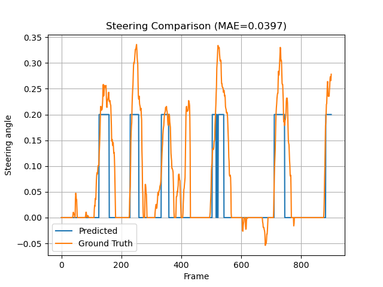

# Road Follower (YOLO-Based Pipeline)

This project implements a ROS 2 road-following pipeline using segmentation masks and a custom control algorithm. The goal is to process incoming mask images and compute a steering angle for autonomous driving.

---

## Project Structure (Minimal)

```
ros2_ws/
├── src/
│ └── road_follower/
│ ├── bagfiles/
│ │ └── cp_racetrack_augmented/
│ ├── launch/
│ ├── plots/
│ ├── road_follower/
│ │ ├── init.py
│ │ ├── plot_utils.py
│ │ ├── road_follower_yolo.py
│ │ └── yolo_pipeline.py
│ └── setup.py
```

---

## How It Works

The main node is:

```
road_follower/road_follower_yolo.py
````

Inside this node, the pipeline is imported with:

```python
from road_follower.yolo_pipeline import RoadControlPipeline
````

This means that all control logic must be implemented in:

```
road_follower/yolo_pipeline.py
```

A basic structure is already implemented. The key line is:

```python
steering_angle = self.ctrl.run_control_pipeline(mask)
```

The node passes the incoming mask to this function and expects a steering angle in return.

---

## Data Flow

The node subscribes to segmentation masks:

```python
self.sub = self.create_subscription(CompressedImage, '/mask', self.mask_callback, self.qos_profile)
```

Whenever a new mask is received:

* `mask_callback` is triggered
* The mask is passed to your pipeline
* Your pipeline computes a steering angle
* The node publishes a control command

---

## Your Task

Go to:

```
road_follower/yolo_pipeline.py
```

Implement your logic inside:

```python
def run_control_pipeline(self, mask):
```

Integrate the function you developed in Colab here.

---

## Running the System

### 1. Play the bagfile

```bash
ros2 bag play /home/user/ros2_ws/src/road_follower/bagfiles/cp_racetrack_augmented
```

### 2. Run the node

```bash
ros2 run road_follower road_follower_yolo
```

---

## Evaluation

When you stop the program with Ctrl+C, a plot is saved at:

```
plots/steering_plot.png
```

This plot shows predicted vs ground truth steering and the MAE.

---

## Example Plot




